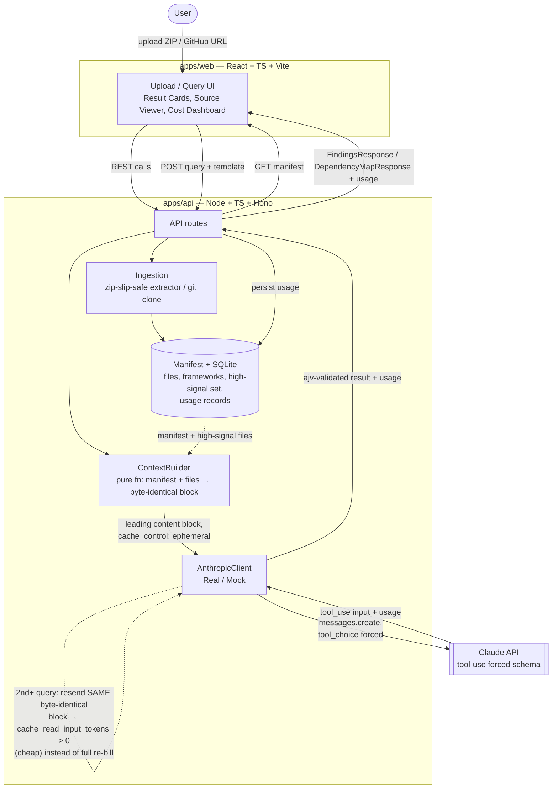

# AI-Powered Full-Stack Code Analyzer

A browser-based tool that lets a developer upload a codebase (public GitHub repo URL or ZIP)
and query it in natural language — "find N+1 query patterns," "audit auth flows for security
issues," "suggest TypeScript improvements," "map module dependencies." The backend ingests and
summarizes the codebase once, caches that context with Claude's prompt caching, and reuses it
across every subsequent query so repeated analysis on the same repo is fast and cheap instead
of re-sending the full codebase context on every request. Results render as structured,
schema-validated cards with file/line links, source excerpts, and before/after diffs; a cost
dashboard shows real token usage and the cache-driven savings.

This is a portfolio project built to demonstrate full-stack + applied-AI engineering
competence — React/TypeScript frontend, Node/TypeScript backend, LLM orchestration with
Anthropic's Claude API, forced structured output via tool-use, prompt-caching cost
optimization, and a fully automated test pyramid (no manual click-through testing required to
validate correctness). It is not a commercial product or a replacement for static-analysis
tools like ESLint/Semgrep/CodeQL — it complements them with a natural-language reasoning layer
over the codebase.

## Architecture



**The cached-context-reuse loop** (the architectural centerpiece): `ContextBuilder` is a pure
function of `(manifest, highSignalFileContents)` — no timestamps, no random ids, sorted file
lists — so it produces the exact same bytes every time a codebase's content hash hasn't
changed. `AnthropicClient` always marks that leading block `cache_control: { type: "ephemeral"
}`. The **first** query for a codebase pays full input-token price to populate Anthropic's
prompt cache (`cache_creation_input_tokens`); **every subsequent query** for that same codebase
resends the identical block and gets billed the much cheaper `cache_read_input_tokens` rate
instead of full input price — only the trailing user query text changes between calls. A
re-upload (new content hash) is the only thing allowed to invalidate and rebuild the cached
block. See `.claude/CLAUDE.md` and `apps/api/src/lib/context-builder.ts` /
`apps/api/src/lib/anthropic-client.ts` for the enforced invariants.

## Tech stack

| Layer | Choice |
|---|---|
| Frontend | React + TypeScript + Vite, Tailwind CSS |
| Backend | Node.js + TypeScript, [Hono](https://hono.dev/) |
| Shared types/schemas | `packages/shared` — Zod schemas as source of truth, JSON Schemas generated via `zod-to-json-schema` for both Anthropic tool `input_schema` and `ajv` response validation |
| LLM | Anthropic Claude API — prompt caching (`cache_control: ephemeral`) + forced structured output (tool-use, `tool_choice: {type:"tool", ...}`) |
| Storage | SQLite (`better-sqlite3`) — manifests, usage records |
| Testing | Vitest (unit + component), Supertest (integration), Playwright (E2E), ajv (schema contract tests) |
| CI | GitHub Actions — lint → typecheck → unit → integration → build → e2e, required check |
| Deployment | Vercel (frontend), Render (backend + SQLite on a persistent disk) |

## Setup

### Quick start (TL;DR)

```bash
git clone <this-repo-url>
cd full-stack-code-analyzer
npm install
npm run dev
```

Then open the URL Vite prints (usually `http://localhost:5173`) in your browser. That's it —
no API key needed. The app ships with `LLM_MOCK=1` by default, so it runs fully offline with
realistic, deterministic fake responses instead of calling the real Claude API. You can upload
a ZIP or paste a public GitHub URL and try every feature for free.

Want to hit the real Claude API instead of the mock? Skip to
[Environment variables](#environment-variables) below.

### Prerequisites
- [Node.js](https://nodejs.org/) version 20 or newer — check with `node -v`
- npm version 10 or newer (comes bundled with Node.js) — check with `npm -v`
- This repo is a single monorepo (multiple apps in one repository) managed with npm
  workspaces, so you only ever run one `npm install` at the root — no need to install
  dependencies separately in each app folder.

### Install

```bash
npm install
```

This one command installs dependencies for every app in the repo at once
(`apps/web` the frontend, `apps/api` the backend, `packages/shared` the shared types, and
`tests-e2e` the end-to-end tests) using the single lockfile at the repo root.

### Environment variables

Environment variables are settings read from a `.env` file that configure how the backend
runs, without you having to edit code. To customize any of them, copy the example file into
place and edit it:

```bash
cp .env.example apps/api/.env
```

If you skip this step entirely, the app still runs — it falls back to the sensible defaults
listed below (mock LLM, port 3001, local SQLite file, etc).

| Variable | Default | Purpose |
|---|---|---|
| `PORT` | `3001` | The port the API server listens on |
| `MAX_UPLOAD_BYTES` | `52428800` (50MB) | Largest ZIP file the upload endpoint will accept |
| `MAX_UPLOAD_FILES` | `2000` | Largest number of files a single ZIP upload may contain |
| `HIGH_SIGNAL_TOKEN_BUDGET` | `60000` | How many tokens' worth of source files get included in full in the cached context sent to Claude |
| `DB_PATH` | `./data/code-analyzer.sqlite` | Where the local SQLite database file is stored (set to `:memory:` for a throwaway, non-persistent database) |
| `LLM_MOCK` | `1` | **The most important one.** When `1` (the default), the API uses a built-in `MockAnthropicClient` that returns realistic canned responses — no network calls, no API key needed, no cost, and fully repeatable results. This is what local development, CI, and every automated test run against. Only set this to `0` if you want to make real calls to Anthropic's Claude API (see below). |
| `ANTHROPIC_API_KEY` | *(empty)* | Your real Anthropic API key, from [console.anthropic.com](https://console.anthropic.com/). Only required when `LLM_MOCK=0`. |
| `ANTHROPIC_MODEL` | `claude-sonnet-4-5-20250929` | Which Claude model to call when making real (non-mocked) requests |

### Run

```bash
npm run dev
```

This single command starts both the backend API (`apps/api`, with auto-restart on file
changes) and the frontend dev server (`apps/web`, Vite) together. Once it's running, open the
frontend URL printed in your terminal to use the app.

### Test

Running the tests is optional if you just want to try the app, but useful if you're modifying
the code and want to confirm nothing broke.

```bash
npm test
```

This runs the entire test suite in order — unit tests, then integration tests, then
end-to-end (E2E) browser tests — and is the single command that answers "is the repo healthy?"

If you want to run just one layer of tests (for example, while iterating on a specific part of
the code), use one of these instead:

```bash
npm run test:unit                                          # fast, no server needed: shared + api + web unit tests
npm run test:unit --workspace=apps/api                      # backend unit tests only
npm run test:integration --workspace=apps/api               # backend integration tests (API + mocked Claude client)
npm run test:unit --workspace=apps/web                      # frontend component tests
npx playwright install --with-deps chromium                 # one-time setup, only needed before your first E2E run
npm run test:e2e --workspace=tests-e2e                       # full browser-driven E2E tests (still mocked, no API key needed)
npm run lint                                                 # style/quality checks across the whole repo
npm run typecheck                                            # verifies TypeScript types across every app
npm run build                                                # builds everything for production, in the right order
```

Good to know: no automated test in this repo ever calls the real Anthropic API, so running
tests never costs money and never requires an API key — see "Never call the real Anthropic API
in tests" in `.claude/CLAUDE.md` for the details.

### Test pyramid

| Layer | Tool | What it covers |
|---|---|---|
| Unit | Vitest | Manifest builder, file-tree filtering, cache-key hashing, cost-calculation math, JSON-schema validation of LLM output, Zod schema fixtures (valid + deliberately invalid) |
| Contract | ajv (inside unit/integration suites) | Every query template's output validated against its generated JSON Schema, valid and invalid fixtures |
| Integration | Supertest + `MockAnthropicClient` | Ingestion endpoint with fixture ZIPs (including a malicious zip-slip fixture and an oversized fixture); query endpoint — first-query cache_control marking, **byte-identical leading-context-block assertion on the second query**, retry-then-typed-error on malformed mock responses, cache invalidation on re-upload |
| Component | Vitest + React Testing Library | UploadView, ArchitectureSummary, QueryBuilder, ResultCards (diff2html), SourceViewer, CostDashboard — all against fixture data, no live backend |
| E2E | Playwright, `LLM_MOCK=1` | Upload → architecture summary; security-audit template → finding cards → source viewer → diff expansion; second query against the same codebase → nonzero cache-read tokens visible in the cost dashboard; invalid upload → error state, not a crash |

64/64 tests green as of M4 (unit + integration + component + mocked E2E), enforced on every
push via the required GitHub Actions check (`.github/workflows/ci.yml`).

## Measured cost savings (mocked run — clearly labeled)

There is no live Anthropic API key configured in this development/CI environment (by design —
see `LLM_MOCK` above), so the numbers below are **not** a real-money API bill. They are real
**usage objects** produced by running the actual production code path —
`ContextBuilder.buildContextBlock` building the real leading context block for a fixture
manifest, then `createDefaultMockClient()` (the same mock client the app wires up when
`LLM_MOCK=1`, and the one every integration/E2E test runs against) returning its canned-but-
schema-valid responses — followed by the **exact same cost formula** the app's own
`UsageRepo`/`packages/shared/src/usage.ts` use to compute `actualEstimatedCostUsd` and the
`noCacheBaseline` computed counterfactual (published illustrative Claude pricing:
$3/MTok input, $15/MTok output, $3.75/MTok cache write, $0.30/MTok cache read).

Reproduce with:

```bash
npm run build --workspace=apps/api
node scripts/measure-cache-savings.mjs
```

Two queries run against the same fixture codebase (`sample-repo`, 3 high-signal files):

| Query | `input_tokens` | `cache_creation_input_tokens` | `cache_read_input_tokens` | `output_tokens` |
|---|---:|---:|---:|---:|
| 1. "Run a security audit of the auth flow" | 500 | 5000 | 0 | 200 |
| 2. "Find N+1 query patterns" (same codebase) | 500 | 0 | 4321 | 200 |

Query 2 shows `cache_creation_input_tokens: 0` and `cache_read_input_tokens: 4321 > 0` — the
prompt cache hit instead of re-billing the full context, because `ContextBuilder` sent the
byte-identical leading block both times.

Feeding those two usage records through the app's own cost math:

| | Actual (with caching) | No-cache baseline *(computed counterfactual)* |
|---|---:|---:|
| Cost for 2 queries | **$0.029046** | **$0.036000** |
| Savings | **$0.006954 (19.3%)** | — |

The no-cache baseline assumes every query re-sent the full context (5000 tokens — the largest
observed cache write/read for this codebase) as fresh billed input, per
`assumedInputTokensPerQuery × queryCount` in `apps/api/src/db/usage-repo.ts`, and is always
returned to the frontend flagged `isComputedCounterfactual: true` — it is a computed
counterfactual, never presented as a live measurement, exactly per PRD §5.5.

Savings scale with query count and context size: this fixture uses a tiny 3-file context, so
19.3% is a conservative floor — a real repo's high-signal context is typically tens of
thousands of tokens, and cache reads are billed at 10% of fresh input price, so a real session
of 5-10 queries against one codebase would show dramatically larger absolute and percentage
savings than this minimal illustrative run.

## Deployment

You don't need to deploy anything to try this project locally (see [Quick start](#quick-start-tldr)
above) — deploying is only needed if you want a public, shareable URL. This app deploys as two
separate pieces: a static frontend on Vercel and a backend API on Render. Both platforms have
free tiers, so a demo deployment can cost nothing if you leave `LLM_MOCK=1`.

Not yet deployed — the configuration below is ready to use, but no live URL exists yet.

**Live demo:** _not deployed yet — add the URL here after deploying (see steps below)._

### Frontend — Vercel

Vercel hosts the static React frontend. The build settings are already defined in
`apps/web/vercel.json`, so you shouldn't need to configure anything by hand.

1. Go to [vercel.com](https://vercel.com/), create a new project, and import this repo.
2. When asked for the project root / root directory, set it to `apps/web`.
3. Vercel will automatically detect and use `apps/web/vercel.json`, which already knows how to
   build `packages/shared` first, then `apps/web`, and serve the result correctly.
4. Add one environment variable in the Vercel project settings so the frontend knows where
   your backend lives: `VITE_API_URL` = the URL of your deployed Render API (from the step
   below).
5. Click Deploy. From then on, every push to `main` automatically redeploys.

### Backend — Render

Render hosts the Node.js API and its SQLite database. The service configuration is already
defined in `render.yaml` at the repo root.

1. Go to [render.com](https://render.com/), click "New +" → "Blueprint", and point it at this
   repo. Render reads `render.yaml` automatically and sets up a Node web service named
   `code-analyzer-api` — no manual configuration needed.
2. It builds with `npm install && npm run build --workspace=packages/shared && npm run build --workspace=apps/api`,
   and starts with `npm run start --workspace=apps/api` (which runs `node dist/server.js`).
3. Optional — only needed if you want the deployed instance to call the real Claude API instead
   of the mock: set the `ANTHROPIC_API_KEY` secret in the Render dashboard (it's marked
   `sync: false` in the blueprint, meaning it must be entered manually and is never committed
   to the repo). If you skip this, leave `LLM_MOCK=1` and you get a fully working, free,
   deterministic demo.
4. Nothing else to configure: `render.yaml` already provisions a 1GB persistent disk mounted
   at `/data`, with `DB_PATH` pointing into it. This matters because Render's regular
   filesystem is wiped on every redeploy/restart — without a persistent disk, your SQLite
   database (and every uploaded codebase) would disappear each time you deploy.
5. Once deployed, you can confirm the API is healthy by visiting `<your-render-url>/api/health`.

## Milestones (PRD §8)

- [x] **M0 — Skeleton:** npm workspaces monorepo, shared eslint/prettier/tsconfig (strict), CI
      pipeline green on trivial tests, Playwright scaffold.
- [x] **M1 — Ingestion:** ZIP upload + GitHub URL clone, zip-slip-protected extraction with
      size/file caps, manifest builder with high-signal file scoring, SQLite persistence,
      manifest viewer UI, unit + integration tests green.
- [x] **M2 — Query + Caching:** `ContextBuilder` with the byte-identical cache invariant,
      `AnthropicClient` (real + mock) forcing tool-use structured output validated via ajv with
      one retry then a typed `SchemaValidationError`, usage persisted per query from real
      `usage` objects, mocked integration tests including the byte-identical cache-prefix
      assertion.
- [x] **M3 — Result UI:** finding cards (severity-colored, collapsible snippet/diff via
      diff2html), file/line-linked source viewer, component tests against fixture data.
- [x] **M4 — Templates + polish:** all five query templates wired into the query builder, cost
      dashboard driven by real usage totals + computed no-cache baseline, full Playwright E2E
      suite green in CI under `LLM_MOCK=1`.
- [x] **M5 — Ship:** README (this file) with architecture diagram, setup instructions, and a
      measured (mocked, clearly labeled) cost-savings run; MIT license; Vercel + Render
      deployment config documented above.

## Success metrics (PRD §9)

- ✅ Demonstrable cache hit on the 2nd+ query for a codebase (`cache_read_input_tokens > 0` in
  logged usage) — see the measured run above and the E2E cost-dashboard assertion.
- ✅ CI green with zero manual test steps required to validate a PR — `npm test` from the repo
  root runs the full pyramid.
- ✅ A README section (this one) showing real before/after cost numbers, derived from running
  the actual `ContextBuilder` + `AnthropicClient` code path, clearly labeled as mocked since no
  live API key exists in this environment.
- ✅ End-to-end flow (upload → query → findings with working file/line links and diffs) is
  covered by the Playwright E2E suite against fixture repos.
